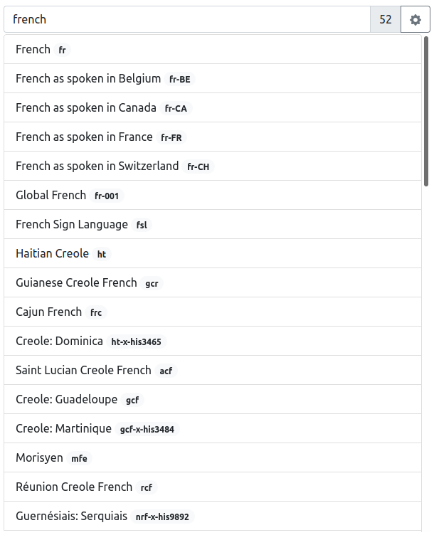
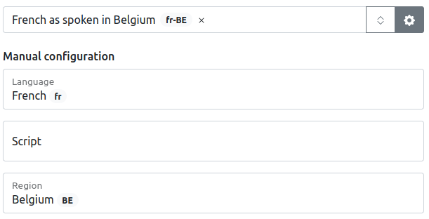
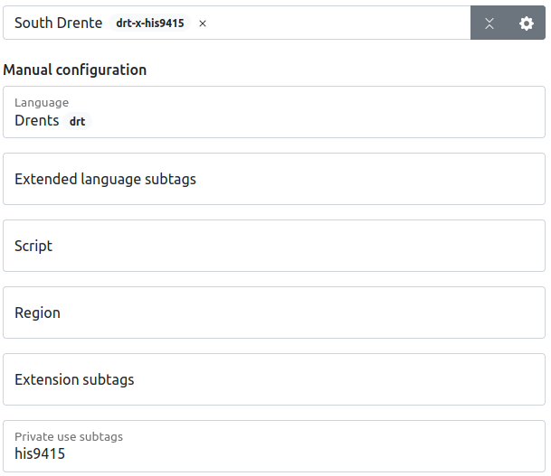

# BCP47 Picker

This is a pluggable BCP47 picker. It allows the developer to add bcp47 tags with a label that is searchable. It uses a Trie structure so results are instant. The total size of the package is quite big. 

## Demo

[Demo](https://bcp47.danielbeeke.nl)

## Install

```npm install bcp47-picker```

## Details 

Datasets (it is possible to use totally different ones):
- https://www.mesaonline.org/language-metadata-table
- https://globalrecordings.net/en/rod

Core datasets and specs:
*   [`wooorm/bcp-47`](https://github.com/wooorm/bcp-47-match)
    — parse and stringify BCP 47 language tags
*   [`wooorm/iso-3166`](https://github.com/wooorm/iso-3166)
    — ISO 3166 codes
*   [`wooorm/iso-639-2`](https://github.com/wooorm/iso-639-2)
    — ISO 639-2 codes
*   [`wooorm/iso-639-3`](https://github.com/wooorm/iso-639-3)
    — ISO 639-3 codes
*   [`wooorm/iso-15924`](https://github.com/wooorm/iso-15924)
    — ISO 15924 codes
*   [`wooorm/un-m49`](https://github.com/wooorm/un-m49)
    — UN M49 codes

## Screenshots





## Future goals:

- Tree shakeable
- Plugins for 'private use subtags' so that a value can be entered and viewed with a custom sub widget.
- Translations for the UI via fluent.js
- Cleanup CSS (Make Bootstrap fully optional)
